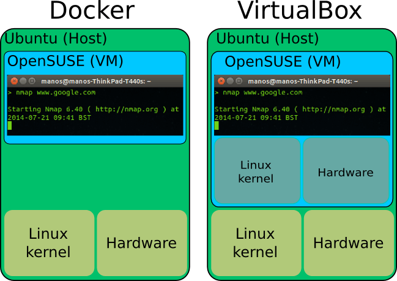
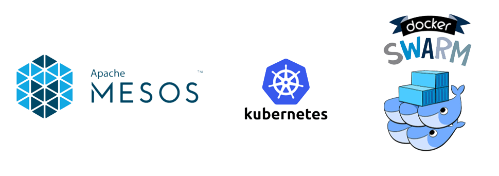
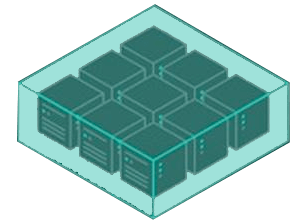
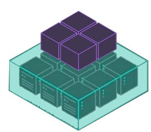

<!--

WARNING!! DON'T EDIT THE FILE README.md on the root of the project, that one is a GENERATED FILE!

You should just edit the source file at src/README.md - the one which stars with ## Docker Compose

-->

## Docker Compose

<!--  -->

&nbsp;

&nbsp;

Victor Mauricio Gomes
<br>
[victor.gomes@terceiro-sky.com.br](mailto:victor.gomes@terceiro-sky.com.br)
<br>
<br>
DevOps

&nbsp;

&nbsp;

<!-- Victor Mauricio Gomes

*locomotiv.file@gmail.com* -->

29 de agosto de 2018

---

## Agenda

 - Porque Docker Containers?
  - Imagens oficiais Java, Node, Mysql, Mongodb etc.
  - Imagens Customizadas (Dockerfile)
 - Docker Compose versões 1, 2 e 3
 - Arquitetura Multi-Container na Prática
- Executando o Docker-Compose
- Escalando os Containers
- Oque é o Docker Swarm
 - Oque é um Cluster
 - Como funciona o Docker Swarm
- Mais material
- Dúvidas?

---

## Porque Docker Containers?

Os Containers podem ter qualquer outra distribuição de linux, apesar de usar o Linux Kernel do Host.


 

----

#### Imagens oficiais Java, Node, Mysql, Mongodb etc.
 
  - Java [https://hub.docker.com/_/opensdk/](https://hub.docker.com/_/opensdk/)
  - Node [https://hub.docker.com/_/node/](https://hub.docker.com/_/node/)
  - NGINX [https://hub.docker.com/_/nginx/](https://hub.docker.com/_/nginx/)
  - MongoDB [https://hub.docker.com/_/mongo/](https://hub.docker.com/_/mongo/)
  - MySQL [https://hub.docker.com/_/mysql/](https://hub.docker.com/_/mysql/)
  - TomCat [https://hub.docker.com/_/tomcat/](https://hub.docker.com/_/tomcat/)
  - Jenkins [https://hub.docker.com/r/jenkins/jenkins/](https://hub.docker.com/r/jenkins/jenkins/)
  - CentOS [https://hub.docker.com/_/centos/](https://hub.docker.com/_/centos/)
  - Debian [https://hub.docker.com/_/debian/](https://hub.docker.com/_/debian/)
  - [Lista de Repositórios Oficiais](https://hub.docker.com/explore/)
  

----

#### Imagens Customizadas (Dockerfile)
 
```
FROM ubuntu:16.10

RUN apt-get update && apt-get install -y --allow-unauthenticated software-properties-common \
    && apt-key adv --recv-keys --keyserver hkp://keyserver.ubuntu.com:80 0x5a16e7281be7a449 \
    && add-apt-repository "deb http://dl.hhvm.com/ubuntu $(lsb_release -sc)-lts-3.18 main" \
    && apt-get update \
    && apt-get install -y --allow-unauthenticated hhvm hhvm-dev autoconf automake libtool wget

RUN mkdir /etc/mongodb \
    && cd /etc/mongodb \
    && wget https://github.com/mongodb/mongo-hhvm-driver/releases/download/1.2.3/hhvm-mongodb-1.2.3.tgz && tar xvzf hhvm-mongodb-1.2.3.tgz && rm hhvm-mongodb-1.2.3.tgz \
    && cd ./hhvm-mongodb-1.2.3/ \
    && hphpize \
    && cmake . \
    && make configlib \
    && make -j $(nproc) \
    && make install

RUN apt-get update && apt-get install -y curl \
    && curl -sS https://getcomposer.org/installer -o composer-setup.php \
    && php composer-setup.php --install-dir=/usr/local/bin --filename=composer

RUN usermod -u 1000 www-data

COPY php.ini /etc/hhvm
COPY server.ini /etc/hhvm

RUN apt-get clean && rm -rf /var/lib/apt/lists/* /tmp/* /var/tmp/*

EXPOSE 9000

WORKDIR /var/www/site

CMD ["hhvm", "--mode=server"]
```

---

## Docker Compose


&nbsp;


&nbsp;
&nbsp;

Compose é uma ferramenta para definir e executar aplicações ***multi-container*** em Docker.

---

### Docker Compose versões 1, 2 e 3

Na ***versão 1***, é declarado apenas os serviços, criando a conexão deles através do ***link*** e interligando os volumes com ***volumes_from***, exemplo:
```
nginx:
  build: ./nginx
  ports:
    - 80:80
    - 443:443
  links:
    - phpfpm-site
    - phpfpm-blog
    - mongoexpress
    - phpmyadmin
  volumes_from:
    - site
    - volume-blog
    - volume-cache
  volumes:
    - ./logs/nginx/:/var/log/nginx
  restart: always
```

----
### Docker Compose versões 1, 2 e 3

Na ***versão 2*** o Compose passa a ter uma declaração específica para ***networks*** e ***volumes***, além dos serviços ficarem abaixo do nó de ***services***.

```
version: "2.2"

networks:
  proxy:
  database:

volumes:
  uploads:
  dbsql:
  dbnosql:

services:
```

----

### Docker Compose versões 1, 2 e 3

Na ***versão 3*** o Compose é dedicado a um ***stack*** de SWARM, só é permitido usar imagens de repositório. Parâmetros específicos foram adicionados para orquestar o ***deploy***, exemplo:

```
version: "3.6"

services:
  memcached:
    image: memcached:1.5.9-alpine
    networks:
      - backend
    ports:
      - 11211
    deploy:
      placement:
        constraints: [node.role == worker]
      resources:
        limits:
          memory: 256M
        reservations:
          memory: 64M
```

---

## Arquitetura Multi-Container na prática


Vamos adicionar containers interligados, definir volumes de persistência e adicionar arquivos de configurações.

----

### docker-compose.yml
Vamos preparar as ***networks*** para interligar os containers e definir os ***volumes*** de persistência de dados.

```
version: "2.2"

networks:
  proxy:
  database:

volumes:
  uploads:
  dbsql:
  dbnosql:

services:
```

Acessando a localização dos Volumes do Docker
```
$ screen ~/Library/Containers/com.docker.docker/Data/com.docker.driver.amd64-linux/tty
$ cd /var/lib/docker/volumes
```

----

Adicionando container ***MySQL***

```
  mysql:
    image: mysql
    command: --default-authentication-plugin=mysql_native_password
    restart: always
    networks:
      - database
    volumes:
      - "dbsql:/var/lib/mysql"
    environment:
      MYSQL_ROOT_PASSWORD: "123456"
      MYSQL_DATABASE: "example"
      MYSQL_USER: "admin"
      MYSQL_PASSWORD: "1234"
    ports:
      - "15307:3306"
```

----

Adicionando container ***PhpMyAdmin***

```
  phpmyadmin:
    image: phpmyadmin/phpmyadmin:latest
    networks:
      - database
      - proxy
    links:
      - mysql:db
    ports:
      - 80
    environment:
      PMA_ARBITRARY: 1
      MYSQL_USERNAME: root
      MYSQL_ROOT_PASSWORD: "123456"
```

----

Adicionando container Mongodb
```
  mongodb:
    image: mongo
    networks:
      - database
    restart: always
    environment:
      MONGO_INITDB_ROOT_USERNAME: root
      MONGO_INITDB_ROOT_PASSWORD: example
```

----

Adicionando container MongoExpress
```
  mongoexpress:
    image: mongo-express
    networks:
      - database
      - proxy
    ports:
      - 8081
    environment:
      ME_CONFIG_MONGODB_SERVER: mongodb
      ME_CONFIG_BASICAUTH_USERNAME: 'admin'
      ME_CONFIG_BASICAUTH_PASSWORD: '1234'
      ME_CONFIG_MONGODB_ADMINUSERNAME: 'root'
      ME_CONFIG_MONGODB_ADMINPASSWORD: 'example'
```

----

Adicionando container de ***NGINX***, com arquivos de configuração

```
  nginx:
    build: ./nginx
    networks:
      - proxy
    volumes:
      - ./nginx/sites-enabled/:/etc/nginx/conf.d/
      - ./www:/var/www
      - ./logs/nginx:/var/log/nginx
    ports:
      - 80:80
      - 443:443
```

---

#### Executando o Docker-Compose

Build

```
$ docker-compose build
```

Run
```
$ docker-compose up
```

Derrubando os containers
```
$ docker-compose kill
```

Run em modo Daemon (deixar rodando)
```
$ docker-compose up -d
```

Buildando e executando como daemon em um só comando:
```
$ docker-compose up -d --build
```

---

### Escalando os Containers


No docker-compose versão 1 e 2
```
workerjava:
  image: openjdk-9
  scale: 2
```
```
$ docker-compose scale workerjava=2
```

No docker-compose versão 3 (SWARM)
```
workerjava:
  image: openjdk-9
  deploy:
      replicas: 3
      placement:
        constraints: [node.role == worker]
```
```
$ docker service scale stackname_workerjava=3
```

---

## Oque é o Docker Swarm
 
Docker Swarm é um sistema de Cluster, assim como Apache Mesos, DC/OS e Kubernetes
 


----

#### Oque é um Cluster
 
Na sua forma mais básica um cluster é um sistema que compreende dois ou mais computadores ou sistemas (denominados nodos) na qual trabalham em conjunto para executar aplicações ou realizar outras tarefas.



Este conceito é denominado transparência do sistema.

----

#### Como funciona o Docker Swarm

O Docker Swarm é uma ferramenta nativa do Docker que permite a criação de clusters de Docker, ou seja, podemos fazer com que diversos hosts de Docker estejam dentro do mesmo pool de recursos, facilitando assim o deploy de containers.



Um container é executado por um dos nós de ***worker*** ou de ***manager***.

---

## Mais material

&nbsp;

 - Projeto Prático no [GITHUB](https://github.com/victorlocomotiv/dev-talk-docker-compose)
 - Play With Docker &nbsp; - &nbsp;[labs.play-with-docker.com](https://labs.play-with-docker.com/)
 - Locomotiv &nbsp; - &nbsp;[www.locomotiv.com.br](http://www.locomotiv.com.br/)
 - [Docker Compose 3 Documentation](https://docs.docker.com/compose/compose-file/)
 - [Docker Compose 2 Documentation](https://docs.docker.com/compose/compose-file/compose-file-v2/)
 - [Docker Compose 1 Documentation](https://docs.docker.com/compose/compose-file/compose-file-v1/)
 
&nbsp;


---

## Dúvidas?

&nbsp;

Victor Mauricio Gomes
<br/>
[victor.gomes@terceiro-sky.com.br](mailto:victor.gomes@terceiro-sky.com.br)
<br/>
&nbsp;
<br/>
Devops TN Digital

&nbsp;

FIM

