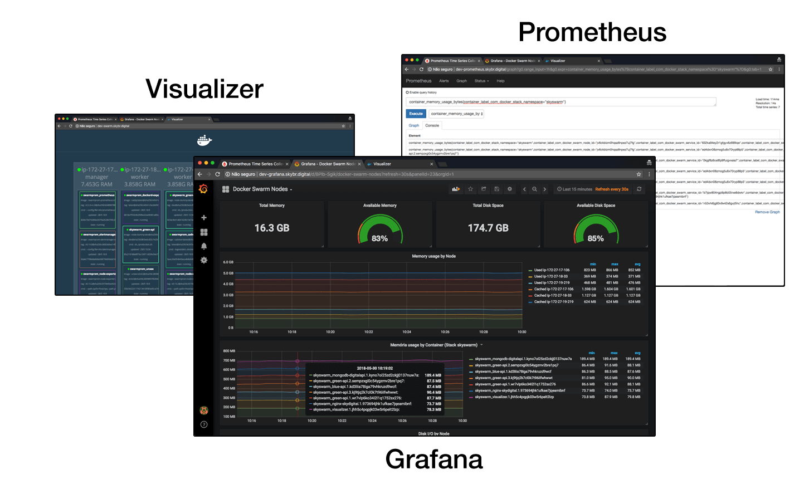

<!--

WARNING!! DON'T EDIT THE FILE README.md on the root of the project, that one is a GENERATED FILE!

You should just edit the source file at src/README.md - the one which stars with ## DevOps SKY - Docker Swarm

-->

## DevOps SKY - Docker Swarm

<!--  -->

&nbsp;
&nbsp;

DevOps SKY

&nbsp;
&nbsp;

<!-- Victor Mauricio Gomes

*victor.gomes@terceiro-sky.com.br* -->

29 de maio de 2018

---

## Agenda

 - Porque Docker Containers?
  - Imagens oficiais Java, Node, Mysql, Mongodb etc.
  - Imagens Customizadas (Dockerfile)
 - Oque é o Docker Swarm
  - Oque é um Cluster
  - Como funciona o Docker Swarm
  - Setup - AWS Auto Scaling do Cluster de Worker
 - Monitoramento
  - Swarm Visualizer - Manager e Workers
  - Prometheus - Query de logs
  - Grafana - Monitorando Clusters e Containers


----

 - Orquestrando os Containers e Microserviços
  - Escalando Containers de Serviços
  - Load Balancer
  - BlueGreen FallBack
  - Reservando e limitando, CPU e RAM por container
 - Deploy CI CD com Jenkins
  - Construindo os Containers
  - Repositório de Containers (AWS ECR)
 - Orquestrando os Ambientes
  - Desenvolvimento
  - Teste (dev)
  - Homologação (hml)
  - Produção (prd)
 - Dúvidas


---

## Porque Docker Containers?

Os Containers podem ter qualquer outra distribuição de linux, apesar de usar o Linux Kernel do Host.


 

----

#### Imagens oficiais Java, Node, Mysql, Mongodb etc.
 
  - Java [https://hub.docker.com/_/opensdk/](https://hub.docker.com/_/opensdk/)
  - Node [https://hub.docker.com/_/node/](https://hub.docker.com/_/node/)
  - NGINX [https://hub.docker.com/_/nginx/](https://hub.docker.com/_/nginx/)
  - MongoDB [https://hub.docker.com/_/mongo/](https://hub.docker.com/_/mongo/)
  - MySQL [https://hub.docker.com/_/mysql/](https://hub.docker.com/_/mysql/)
  - TomCat [https://hub.docker.com/_/tomcat/](https://hub.docker.com/_/tomcat/)
  - Jenkins [https://hub.docker.com/r/jenkins/jenkins/](https://hub.docker.com/r/jenkins/jenkins/)
  - CentOS [https://hub.docker.com/_/centos/](https://hub.docker.com/_/centos/)
  - Debian [https://hub.docker.com/_/debian/](https://hub.docker.com/_/debian/)
  - [Lista de Repositórios Oficiais](https://hub.docker.com/explore/)
  

----

#### Imagens Customizadas (Dockerfile)
 
```
FROM node:9-alpine

COPY ./ /var/www/app

RUN npm install pm2 -g
RUN cd /var/www/app \
	&& npm install

WORKDIR /var/www/app
CMD ["sh","production.sh"]
```

```
FROM alpine:3.6

ENV NODE_VERSION 9.11.1

RUN addgroup -g 1000 node \
    && adduser -u 1000 -G node -s /bin/sh -D node \
    && apk add --no-cache \
        libstdc++ \
...

```

```
#!/bin/bash
pm2-docker start pm2.json
```

  

---

## Oque é o Docker Swarm
 
Docker Swarm é um sistema de Cluster, assim como Apache Mesos, DC/OS e Kubernetes
 


----

#### Oque é um Cluster
 
Na sua forma mais básica um cluster é um sistema que compreende dois ou mais computadores ou sistemas (denominados nodos) na qual trabalham em conjunto para executar aplicações ou realizar outras tarefas.


Este conceito é denominado transparência do sistema.

----

#### Como funciona o Docker Swarm

O Docker Swarm é uma ferramenta nativa do Docker que permite a criação de clusters de Docker, ou seja, podemos fazer com que diversos hosts de Docker estejam dentro do mesmo pool de recursos, facilitando assim o deploy de containers.


Um container é executado por um dos nós de ***worker*** ou de ***manager***.

----

#### Setup - AWS Auto Scaling do Cluster de Worker
 
 Quando a média de uso do CPU dos workers atingir 70%, adiciona mais um worker ao cluster.
 
 ```
 /etc/systemd/system/docker-node-join.service
 ```
 
 ```
 [Unit]
 Description=Docker Swarm Worker Node Cluster
 After=docker.service
 Requires=docker.service
 
 [Service]
 RemainAfterExit=yes
 ExecStartPre=-/usr/bin/docker swarm leave --force
 ExecStart=/usr/bin/docker swarm join --token <SWARM-TOKEN> <IP-MANAGER>:2377
 ExecStop=/usr/bin/docker swarm leave --force
 
 [Install]
 WantedBy=multi-user.target
 ````
 
 ```
 $ systemctl status docker-node-join
 $ systemctl is-active docker-node-join.service
 $ systemctl is-enabled docker-node-join.service
 ```

---

## Monitoramento


 

----

#### Swarm Visualizer - Manager e Workers


[Swarm Visualizer](http://dev-visualizer.skybr.digital)

----

#### Prometheus - Query de logs


[Prometheus](http://dev-prometheus.skybr.digital)

----

#### Grafana - Monitorando Clusters e Containers


[Grafana](http://dev-grafana.skybr.digital)
 

---

## Orquestrando os Containers e Microserviços


O ***Docker Compose***, originalmente chamado de ***fig***, foi criado com o propósito de orquestrar a criação e administração de um conjunto de containers a partir do uso de um simples arquivo de configuração em formato ***YAML***

----

#### docker-compose.yml

```
version: "2"

services:
  dummy:
    build:
      context: .
      dockerfile: Dockerfile.developer
    volumes:
      - ./:/var/www/app
    working_dir: /var/www/app
    ports:
      - 80:8000
    environment:
      COLOR: "green"
      NODE_ENV: "Developer"
      TZ: "America/Sao_Paulo"
    command: sh developer.sh
```
```
### Para dar build na imagem do container
$ docker-compose build
### Para executar os containers (modo daemon)
$ docker-compose up -d
### Para matar os containers
$ docker-compose kill
```

----
   
#### Escalando Containers de Serviços
Escalando pelo docker-compose de deploy ***docker-deploy.yml***

```
### Atribuindo o número de réplicas a estratégia de deploy, no docker-deploy.yml
version: "3.6"

services:
  blue-api:
    image: 432914321234.dkr.ecr.sa-east-1.amazonaws.com/node-dummy:dev
    depends_on:
      - mongodb-digitalapi
    networks:
      - proxy
      - backend
    environment:
      COLOR: "blue"
      NODE_ENV: "production"
      TZ: "America/Sao_Paulo"
    command: "sh ./production.sh"
    ports:
      - 8000
    deploy:
      replicas: 3
      restart_policy:
        condition: on-failure
      placement:
        constraints: [node.role == worker]
```

Escalando pela linha de comando

```
$ docker service scale skyswarm_green-api=3
```


----

#### Docker-compose e NGINX Load Balancer

O ***docker-compose*** permite orquestrar como um container vai interagir com outro, atribuindo DNS com o nome dos serviços apontando o respectivo range de containers.

```
version: "3.6"
networks:
  proxy:
  backend:
services:
  nginx-skydigital:
    image: 432914321234.dkr.ecr.sa-east-1.amazonaws.com/nginx-digital:1.2.15
    networks:
      - proxy
    ports:
      - 80:80
      - 443:443 
  green-api:
    image: 432914321234.dkr.ecr.sa-east-1.amazonaws.com/node-dummy:dev
    networks:
      - proxy
      - backend
    ports:
      - 8000
```

----

#### Docker-compose e NGINX BlueGreen FallBack

Se a versão nova da api, chamada de ***blue*** responder com erro, executa na versão estável anterior, versão ***green***.

```
upstream upstream_green {
    server green-api:8000 fail_timeout=5s max_fails=5;
}
upstream upstream_blue {
    server blue-api:8000 fail_timeout=5s max_fails=5;
}

server {
    listen 80;
    
    location / {
            proxy_intercept_errors on;
            error_page 401 403 404 405 408 444 500 501 502 503 504 505 511 = @fallback;
            
            proxy_pass http://upstream_blue;
            
    }
    
    location @fallback {
        proxy_pass http://upstream_green;
    }
}
```


----

#### Reservando e limitando, CPU e RAM por container

Alguns sistemas são programados para executar suas tarefas o mais rápido possível e para isso irá utilizar toda memória e CPU disponível.

&nbsp;
&nbsp;

Para resolver isso, no ***Docker Swarm*** podemos orquestrar os recursos através do ***Docker Compose***.

```
deploy:
  resources:
    limits:
      cpus: '0.5'
      memory: 50M
    reservations:
      cpus: '0.25'
      memory: 20M
```

----
   
#### Escalando Containers de Serviços
Escalando pelo docker-compose de deploy ***docker-deploy.yml***

```
### Atribuindo o número de réplicas a estratégia de deploy, no docker-deploy.yml
version: "3.6"

services:
  blue-api:
    image: 432914321234.dkr.ecr.sa-east-1.amazonaws.com/node-dummy:dev
    depends_on:
      - mongodb-digitalapi
    networks:
      - proxy
      - backend
    environment:
      COLOR: "blue"
      NODE_ENV: "production"
      TZ: "America/Sao_Paulo"
    command: "sh ./production.sh"
    ports:
      - 8000
    deploy:
      replicas: 3
      restart_policy:
        condition: on-failure
      placement:
        constraints: [node.role == worker]
```

Escalando pela linha de comando

```
$ docker service scale skyswarm_green-api=3
```


---

## Deploy CI CD com Jenkins


Usamos um hook ***post-receive*** do Bitbucket para chamar o ***Jenkins*** a cada ***git push***.

&nbsp;
&nbsp;

O Jenkins por sua vez constrói as imagens dos containers versionadas e atualiza o Docker Swarm Manager.

----

#### Construindo os Containers

Na pipeline do Jenkins, construimos os containers e adicionamos suas respectivas ***tag***

```
stage("docker-build") {
    dir("/var/jenkins/app/source/$ECRREPO/") {
        sh "docker build -t $ECRREPO:dev ."
    }
}
```

----

#### Repositório de Containers (AWS ECR)

O Jenkins da ***push*** dos containers taggeados para o repositório e containers, AWS ECR (ou outro, como Docker Hub).

```
stage("ecr-push") {
    sh "eval \$(aws ecr get-login --no-include-email --region sa-east-1)"
    sh "docker tag $ECRREPO:dev $ECRADDR/$ECRREPO:dev"
    sh "docker push $ECRADDR/$ECRREPO:dev"
}
```

Em seguida o Jenkins se conecta ao ***Swarm Manager*** e manda atualizar os respectivos containers.

```
node("swarm-manager-dev"){
  stage("deploy update image") {
      sh "eval \$(/home/ubuntu/.local/bin/aws ecr get-login --no-include-email --region sa-east-1)"
      sh "docker service update --with-registry-auth --image $ECRADDR/$ECRREPO:dev skyswarm_blue-api"
      sh "docker service update --with-registry-auth --image $ECRADDR/$ECRREPO:dev skyswarm_green-api"
  }
}
```


---

## Orquestrando os Ambientes


Usando o Docker Compose para orquestrar os Containers, tanto de desenvolvimento quanto para um cluster Docker Swarm

----

#### Desenvolvimento

O ambiente é orquestrado através do ***docker-compose.yml***, para fazer o build do container ***Dockerfile*** e iniciar o ambiente.

```
$ docker-compose up -d --build
```

Esse ambiente de desenvolvimento pode e deve ser commitado junto com o projeto, mantendo todos desenvolvedores com um ambiente ***local*** igual, independentemente se a máquina de desenvolvimento é Windows, MacOSX ou Linux.

----

#### Testes (dev)

Todo push da branch ***master*** faz com que o ***Jenkins*** faça o build do container, mande para o ***AWS ECR*** um container com a tag ***:dev***

```
$ git push origin master
```

Nesse processo o ***Jenkins*** também manda o comando para o ***Docker Swarm Manager*** para atualizar a imagem ***:dev***

----

#### Homologação (hml)

Sempre que for adicionada uma tag de versão ao repositório do git, será gerada a imagem do container com a tag ***tag de versão*** e também atualizada a imagem ***:latest***

```
$ git push origin <tag_name>
```

Nesse processo o ***Jenkins*** também manda o comando para o ***Docker Swarm Manager*** para atualizar a imagem ***:latest***


----

#### Produção (prd)

O Swarm de Produção é redundante em duas zonas, por ser orquestrado através de um projeto git, usamos o ***Jenkins*** e o ***Docker Compose*** para orquestrar o deploy com o ***Docker Swarm*** com ***zero downtime***.
```
version: "3.6"
networks:
  proxy:
  backend:
services:
  green-api:
    image: 432914321234.dkr.ecr.sa-east-1.amazonaws.com/node-dummy:1.25.2
...
  blue-api:
    image: 432914321234.dkr.ecr.sa-east-1.amazonaws.com/node-dummy:1.24.16
...
```
Sempre utilizando as ***tags de versão*** nas imagens, garantindo assim o Bluegreen Fallback.

---

## Dúvidas?

&nbsp;
&nbsp;

  
DevOps SKY
